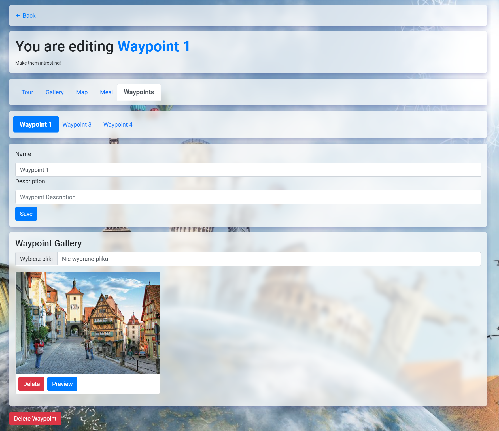

# BOOKMANIA - Find your tour fast!

## Tech:
- ASP.NET MVC, Fluent Validation, AutoMapper, JWT Authorization
- MS SQL
- Entity Framework
- JQuery
- Redis - cache weather data

In bookmania you can create your account as Admin, or normal user. Users Can create agencies that Admin can accept or not. User that creates Agecy recives new role AgencyAdmin and can Edit agency info, add Tours etc. Users can also Filters see tours details and book tours. There is a simulation of tour so users can see progress of tour. Tours can have gallery, map (AgencyAdmin can draw route of the tour, add waypoionts and meals). You can also check weather in waypoint.
App is responsive even for mobile.

## Start app
- Create .env file and fill it with real data [Here is example file](./.env.sample).
- Install all packages
- Run `dotnet run` command

## Api used
- Weather - https://www.visualcrossing.com/resources/documentation/weather-api/timeline-weather-api/
- Custom Map - https://cloud.maptiler.com/auth/widget?next=https://cloud.maptiler.com/maps/

## Overview

- You can create Admin going to /User/CreateAdmin username and password will be admin, 
- You can create regular user in Register page

### Home page

### Add Tour if you have agency!

### As Admin you can decide if the the agency will be created or not!

### Check visible Tours (Tour must be mark as visible to show there)

### Check your data, avatar, manage account, create agancy

### Manage your agency gallery, Tours, general info

### Create road on map

### Create meals

### Set waypoint data (waypoints are added automatically here if you draw them on map)

### Book tours

### See tour progress

### See live map progress

### Check waypoints weather
